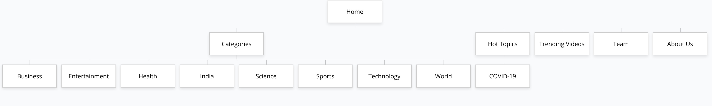

## Welcome to DOTS News ##

**DOTS News** is a news aggregator built as a project, as part of COM212P, Database Systems Course, given by IIITDM Kancheepuram.

**[DOTS News](https://appl-web-news.000webhostapp.com)**

### Overview ###
DOTS News is a news aggregator created as part of coursework assigned as a part of the course Database Systems COM212P.  
####Goals####
- To create a simple news interface without high usage of bandwidth
- To address privacy concerns over data collection (DOTS collects a low amount of data compared to other existing products)
- To allow users to contribute to the project through their own content
- To bring together news from various platforms for convenience of the users

DOTS is aimed at general readers of news. It is also aimed at writers who want to showcase their content.

####Team####
- Vamsi Krishna Thigulla - Team Leader, Content Manager - coe18b056@iiitdm.ac.in
- Hrishikesh Rajesh Menon - Graphic Designer - coe18b024@iiitdm.ac.in
- Srinivasan R. Sharma - User Database Administrator, Backend Developer - coe18b065@iiitdm.ac.in
- Vijay Meena - Primary Front End Developer - ced18i057@iiitdm.ac.in
- Shashank Dokania - Content Validation, Spam Checking - coe18b067@iiitdm.ac.in

